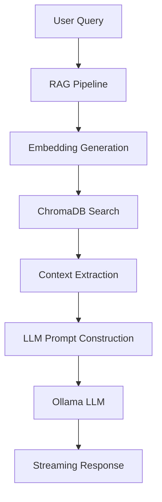
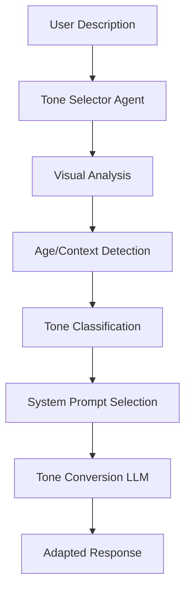
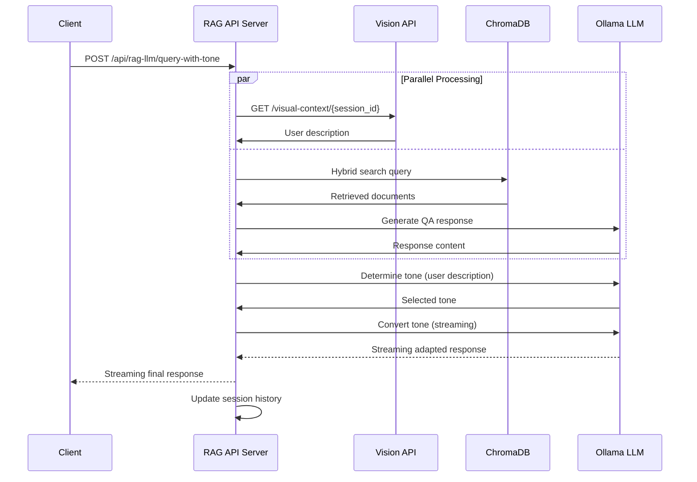

# RAG + LLM Server Methodology

## 1. Overview and Purpose

### 1.1 What the Server Does

The RAG + LLM API Server is a comprehensive Flask-based web service that provides intelligent question-answering capabilities by combining Retrieval Augmented Generation (RAG) with Large Language Models (LLM). The server serves as a bridge between client applications and advanced AI capabilities, offering context-aware, tone-adapted responses with real-time streaming.

**Core Functionalities:**
- **Intelligent Q&A**: Processes user queries using RAG to retrieve relevant context from a knowledge base, then generates responses using LLM
- **Dynamic Tone Adaptation**: Automatically adjusts response tone based on visual user analysis (child-friendly, elder-friendly, professional, casual)
- **Real-time Streaming**: Provides streaming text responses for immediate user feedback
- **Session Management**: Maintains conversation history across multiple interactions
- **Multi-modal Integration**: Integrates with Vision Language Models for user appearance analysis
- **Multi-language Support**: Handles English and Traditional Chinese (zh-tw) responses

### 1.2 Target Use Cases

- **Museum Interactive Systems**: Providing personalized explanations about exhibits
- **Educational Platforms**: Adapting content delivery based on user demographics
- **Customer Service Chatbots**: Context-aware responses with appropriate tone
- **Knowledge Management Systems**: Intelligent document retrieval and explanation

## 2. System Architecture

### 2.1 High-Level Architecture

```
┌─────────────────┐    ┌──────────────────┐    ┌─────────────────┐
│   HTTP Client   │────│   Flask API      │────│  RAG Pipeline   │
│   (Web/Mobile)  │    │   Service        │    │  (ChromaDB)     │
└─────────────────┘    └──────────────────┘    └─────────────────┘
         │                       │                       │
         ▼                       ▼                       ▼
┌─────────────────┐    ┌──────────────────┐    ┌─────────────────┐
│  Session        │    │   Streaming      │    │   Ollama LLM    │
│  Management     │    │   Response       │    │   Service       │
└─────────────────┘    └──────────────────┘    └─────────────────┘
                                │
                                ▼
                    ┌──────────────────┐
                    │   Vision Context │
                    │   API (VLM)      │
                    └──────────────────┘
```

### 2.2 Core Components

#### 2.2.1 RAGLLMAPIService Class
**Purpose**: Main orchestrator that manages API endpoints, session handling, and service coordination.

**Key Attributes:**
- `rag_pipeline`: ImprovedRAGPipeline instance for document retrieval
- `chroma_collection`: ChromaDB collection for vector storage
- `chat_sessions`: In-memory session storage (session_id → chat_history)
- `user_description_server_url`: Vision Context API endpoint

#### 2.2.2 RAG Pipeline Integration
**Purpose**: Retrieves relevant context from the knowledge base using hybrid search.

**Components:**
- **ChromaDB**: Vector database for document embeddings
- **Embedding Model**: nomic-embed-text via Ollama API
- **Hybrid Search**: Combines semantic and keyword search for optimal retrieval

#### 2.2.3 Tone Conversion System
**Purpose**: Adapts response tone based on user characteristics and context.

**Available Tones:**
- `child_friendly`: For children and teenagers
- `elder_friendly`: For elderly users (65+)
- `professional_friendly`: For business/professional contexts
- `casual_friendly`: For general adult users (default)

#### 2.2.4 Vision Context Integration
**Purpose**: Fetches visual user descriptions from VLM service for dynamic tone selection.

**Integration Point**: HTTP API call to Vision Context server (default: localhost:5004)

## 3. Technical Implementation

### 3.1 RAG Processing Workflow



**Detailed Steps:**

1. **Query Embedding**: Convert user query to vector using nomic-embed-text model
2. **Hybrid Search**: Search ChromaDB collection using query embeddings (top_k=10)
3. **Context Processing**: Filter and rank retrieved documents, exclude Q&A patterns
4. **Prompt Construction**: Build system prompt with retrieved context and chat history
5. **LLM Generation**: Send constructed prompt to Ollama LLM service
6. **Response Streaming**: Stream generated tokens back to client with END_FLAG termination

### 3.2 Parallel Processing Architecture

**Innovation**: The server implements parallel processing to minimize latency by executing user description fetching and QA response generation simultaneously.

```python
# Parallel execution using ThreadPoolExecutor
with ThreadPoolExecutor(max_workers=2) as executor:
    # Task 1: Fetch visual context from Vision API
    future_description = executor.submit(self._fetch_user_description_from_server, session_id)
    
    # Task 2: Generate QA response
    future_qa = executor.submit(collect_qa_response)
    
    # Wait for both tasks to complete
    user_description = future_description.result()
    response_content, error = future_qa.result()
```

### 3.3 Dynamic Tone Selection Process



**Implementation Details:**

1. **Visual Analysis**: LLM-based analysis of user appearance descriptions
2. **Rule-based Classification**: Age and context indicators determine appropriate tone
3. **Prompt Engineering**: Specialized system prompts for each tone category
4. **Contextual Integration**: First message behavior vs. subsequent message probability rules
5. **Streaming Conversion**: Real-time tone adaptation with streaming output

### 3.4 System Prompt Engineering

The tone system employs sophisticated prompt engineering with specific guidelines:

**Key Features:**
- **Language Detection**: Automatic detection of Chinese characters to determine target language
- **Appearance Integration**: Mandatory reference in first messages, probability-based in subsequent messages
- **Expression Patterns**: Tone-specific linguistic patterns and particles
- **Context Preservation**: Maintains factual accuracy while adapting emotional tone

## 4. API Endpoints and Functionality

### 4.1 Core Endpoints

#### `/api/rag-llm/query` (POST)
**Purpose**: Main query endpoint with optional tone conversion

**Input Parameters:**
```json
{
  "text_user_msg": "User question",
  "session_id": "optional_session_id", 
  "include_history": true/false,
  "user_description": "VLM visual description",
  "convert_tone": true/false
}
```

**Response**: Streaming text with END_FLAG termination

#### `/api/rag-llm/query-with-tone` (POST)
**Purpose**: Query with automatic dynamic tone conversion

**Workflow:**
1. Parallel processing: Fetch user description + Generate QA response
2. Determine appropriate tone based on visual analysis
3. Convert response tone using specialized LLM agent
4. Stream adapted response to client

#### `/api/rag-llm/convert-tone` (POST)
**Purpose**: Standalone tone conversion service

**Features:**
- Supports streaming and non-streaming modes
- Context-aware conversion using user appearance and original message
- Multiple tone options with specialized prompts

#### `/api/rag-llm/warmup` (POST)
**Purpose**: Model preloading for reduced latency

**Process:**
1. **Embedding Model Warmup**: Test embedding generation with ChromaDB query
2. **LLM Warmup**: Send minimal test request to Ollama service
3. **Performance Metrics**: Returns warmup time and success status

### 4.2 Session Management

#### `/api/rag-llm/sessions/{session_id}/history` (GET/DELETE)
**Purpose**: Chat history management per session

**Features:**
- Retrieve complete conversation history
- Clear session data for privacy
- Message count tracking

#### `/api/rag-llm/close` (POST)
**Purpose**: Graceful connection termination

**Process:**
1. Session existence validation
2. Message count calculation
3. Session cleanup and logging
4. Confirmation response with metrics

## 5. Integration Points

### 5.1 External Service Dependencies

#### 5.1.1 Ollama LLM Service (localhost:11435)
**APIs Used:**
- `/api/chat`: Main chat completion endpoint
- `/api/embeddings`: Text embedding generation

**Configuration:**
- Model: Configurable via `LLM_MODEL_NAME`
- Temperature: Contextual (0.1 for analysis, 0.3 for tone conversion, 0.7 for QA)
- Streaming: Supported for real-time responses

#### 5.1.2 ChromaDB Vector Database
**Purpose**: Document storage and retrieval using vector embeddings

**Configuration:**
- Path: Configurable via `CHROMA_DB_PATH`
- Collection Strategy: Auto-detection with fallback creation
- Embedding Function: nomic-embed-text model

#### 5.1.3 Vision Context API (localhost:5004)
**Endpoint**: `/visual-context/{session_id}`
**Purpose**: Retrieve user appearance descriptions from VLM analysis

**Response Format:**
```json
{
  "available": true/false,
  "visual_context": "User appearance description"
}
```

### 5.2 Data Flow Integration



## 6. Performance Optimizations

### 6.1 Parallel Processing
**Impact**: Reduces total response time by executing independent operations simultaneously
**Implementation**: ThreadPoolExecutor for user description fetching and QA generation

### 6.2 Streaming Responses
**Benefits**: 
- Immediate user feedback
- Reduced perceived latency
- Better user experience for long responses

### 6.3 Model Warmup
**Purpose**: Preload models into memory to eliminate cold start delays
**Components**: Both embedding model and LLM warmup with performance metrics

### 6.4 Session Caching
**Implementation**: In-memory chat history storage with configurable retention
**Benefits**: Context-aware responses without database overhead

## 7. Error Handling and Reliability

### 7.1 Graceful Degradation
- **RAG Failure**: Falls back to LLM-only mode
- **Vision API Unavailable**: Uses default casual_friendly tone
- **ChromaDB Issues**: Creates fallback collections or continues without RAG

### 7.2 Connection Management
- **Timeout Handling**: Configurable timeouts for external service calls
- **Retry Logic**: Implicit retry through service redundancy
- **Graceful Shutdown**: Proper session cleanup on service termination

### 7.3 Monitoring and Diagnostics
- **Health Endpoints**: System status and component health checks
- **Comprehensive Logging**: Structured logging for debugging and monitoring
- **Performance Metrics**: Warmup timing and response performance tracking

## 8. Configuration and Deployment

### 8.1 Configuration Management
**Key Configuration Points:**
- `LLM_MODEL_NAME`: Ollama model selection
- `CHROMA_DB_PATH`: Vector database location
- Host/Port: Service binding configuration
- Vision API URL: External VLM service integration

### 8.2 Deployment Options
**Standalone Deployment:**
```bash
python rag_llm_api.py --host 0.0.0.0 --port 5002 --auto-init
```

**Production Considerations:**
- CORS configuration for cross-origin requests
- Threaded Flask application for concurrent requests
- Auto-initialization option for seamless startup
- Environment variable configuration for security

## 9. Future Enhancement Opportunities

### 9.1 Scalability Improvements
- **Persistent Session Storage**: Database-backed session management
- **Load Balancing**: Multi-instance deployment support
- **Caching Layer**: Redis integration for performance optimization

### 9.2 Feature Extensions
- **Multi-modal Input**: Image and voice input processing
- **Advanced Analytics**: User interaction tracking and analytics
- **A/B Testing**: Dynamic tone selection algorithm improvement

### 9.3 Security Enhancements
- **Authentication**: JWT-based user authentication
- **Rate Limiting**: API abuse prevention
- **Input Validation**: Enhanced security for user inputs

## 10. Conclusion

The RAG + LLM API Server represents a sophisticated integration of multiple AI technologies, providing a comprehensive solution for intelligent, context-aware, and tone-adaptive question-answering. Its parallel processing architecture, dynamic tone selection capabilities, and robust error handling make it suitable for production deployment in various interactive AI applications.

The server's modular design allows for easy extension and customization, while its comprehensive API surface provides flexibility for different client implementation approaches. The combination of RAG for accuracy, LLM for generation quality, and VLM for personalization creates a powerful AI service platform.
