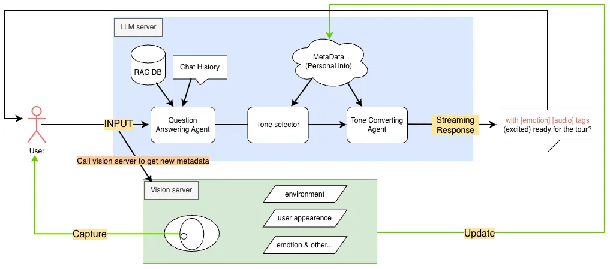

# 🤖 ITRI Museum RAG LLM System

A comprehensive Retrieval-Augmented Generation (RAG) system designed to provide intelligent question-answering capabilities about the Industrial Technology Research Institute (ITRI). This system combines advanced document retrieval with large language models to deliver accurate, contextual responses in both English and Traditional Chinese (繁體中文).

🆕 **NEW**: Now features **VLM-based Dynamic Tone Selection** - automatically adapts response tone based on visual user analysis from Vision Language Models!

## 🖼️ System Workflow Overview

Below is a visual overview of the LLM module workflow:



*The diagram above illustrates the main components and data flow in the ITRI Museum RAG LLM system.*

---


## 🚀 Quick Start Guide

### Step 1: Clone the Repository

First, clone the repository from GitHub:

```bash
git clone git@github.com:HelloHe110/Demo_llm_agent.git
cd Demo_llm_agent
```

**Note**: Make sure you have SSH access configured for GitHub. If you prefer HTTPS, use:
```bash
git clone https://github.com/HelloHe110/Demo_llm_agent.git
cd Demo_llm_agent
```

### Step 2: Set Up Git Configuration (Optional)

Configure your local Git settings:

```bash
git config --local user.name "YourUsername"
git config --local user.email "your.email@example.com"
```

### Step 3: Install Python Dependencies

Install the required Python packages:

```bash
pip install flask flask-cors requests chromadb numpy scikit-learn jieba gradio
```

### Step 4: Set Up Ollama Server

Install and configure the Ollama server:

```bash
# Install Ollama (if not already installed)
curl -fsSL https://ollama.ai/install.sh | sh

# Start Ollama server with GPU support
CUDA_VISIBLE_DEVICES=0,1,2,3 \
OLLAMA_HOST=127.0.0.1:11435 \
OLLAMA_MODELS=/usr/share/ollama/.ollama/models \
OLLAMA_SCHED_SPREAD=1 \
OLLAMA_FLASH_ATTENTION=1 \
OLLAMA_KEEP_ALIVE=60m \
ollama serve
```

### Step 5: Download Required Models

Pull the necessary LLM models:

```bash
# Download the main language model
ollama pull linly-llama3.1:70b-instruct-q4_0

# Download the embedding model
ollama pull nomic-embed-text
```

### Step 6: Start the Supporting Services

#### 6.1 Random User Description Server (Port 5003)
Start the random user description server:

```bash
cd API/
python random_user_description_server.py
```

This server will provide random user descriptions for testing and development purposes on port 5003.

#### 6.2 Vision User Description Server (Port 5004) 
Start the true vision user description server for real-time visual analysis:

```bash
python vision_api_multi_session.py
```

This server provides VLM-based visual context analysis on port 5004. See the [Visual Context API Documentation](LLM_API_SPECIFICATION.md) for detailed specifications.

#### 6.3 RAG LLM API Server with User Description Integration
Launch the main RAG LLM API server with user description server integration:

```bash
cd API/
python3 rag_llm_api.py --auto-init --user-description-server http://localhost:5003
```

For production with vision analysis, use:
```bash
python3 rag_llm_api.py --auto-init --user-description-server http://localhost:5004
```

The server will start on `http://localhost:5002` and automatically initialize the RAG system with dynamic tone selection based on user descriptions.

### Step 7: Complete System Startup

For a complete system deployment, you need to run all servers in parallel. Here's the recommended startup sequence:

#### Terminal 1: Ollama Server
```bash
# Start Ollama with GPU support
CUDA_VISIBLE_DEVICES=0,1,2,3 \
OLLAMA_HOST=127.0.0.1:11435 \
OLLAMA_MODELS=/usr/share/ollama/.ollama/models \
OLLAMA_SCHED_SPREAD=1 \
OLLAMA_FLASH_ATTENTION=1 \
OLLAMA_KEEP_ALIVE=60m \
ollama serve
```

#### Terminal 2: Random User Description Server (Development)
```bash
cd API/
python random_user_description_server.py
# Server starts on port 5003
```

#### Terminal 3: Vision Context API Server (Production)
```bash
python vision_api_multi_session.py
# Server starts on port 5004
```

#### Terminal 4: Main RAG API Server
```bash
cd API/
# For development with random descriptions
python3 rag_llm_api.py --auto-init --user-description-server http://localhost:5003

# For production with vision analysis
python3 rag_llm_api.py --auto-init --user-description-server http://localhost:5004
# Main server starts on port 5002
```

#### Using the Startup Script (Optional)
You can also use the provided startup script:
```bash
./start_servers.sh
```

### Step 8: Test the System

#### Health Check
```bash
# Check main RAG API server
curl http://localhost:5002/health

# Check Ollama server
curl http://localhost:11435/api/tags

# Check random user description server (development)
curl http://localhost:5003/health

# Check vision context API server (production) 
curl http://localhost:5004/sessions
```

#### Run Example Client
```bash
cd API/
python api_client_example.py
```

#### Try Sample Queries
```bash
# English query
curl -X POST http://localhost:5002/api/rag-llm/query \
  -H "Content-Type: application/json" \
  -d '{"text_user_msg": "What is ITRI?", "session_id": "demo"}' \
  --no-buffer

# Traditional Chinese query
curl -X POST http://localhost:5002/api/rag-llm/query \
  -H "Content-Type: application/json" \
  -d '{"text_user_msg": "工研院是什麼？", "session_id": "demo"}' \
  --no-buffer
```

## 🏗️ System Architecture

```
┌─────────────────┐    ┌──────────────────┐    ┌─────────────────┐
│   Client Apps   │────│   Flask API      │────│   RAG Pipeline  │
│                 │    │   (Port 5002)    │    │   + ChromaDB    │
└─────────────────┘    └──────────────────┘    └─────────────────┘
                                │                       │
                                │                       │
                       ┌──────────────────┐    ┌──────────────────┐
                       │   Ollama LLM     │    │ User Description │
                       │  (Port 11435)    │    │    Services      │
                       └──────────────────┘    └──────────────────┘
                                                         │
                                           ┌─────────────┼─────────────┐
                                           │             │             │
                                      ┌─────────────────┐ ┌─────────────────┐
                                      │ Random Desc.    │ │ Vision Context  │
                                      │ Server          │ │ API (VLM)       │
                                      │ (Port 5003)     │ │ (Port 5004)     │
                                      └─────────────────┘ └─────────────────┘
```

### Service Components

- **Main RAG API (Port 5002)**: Core Flask API with streaming responses and session management
- **Ollama LLM (Port 11435)**: Local language model inference server  
- **Random Description Server (Port 5003)**: Provides mock user descriptions for testing
- **Vision Context API (Port 5004)**: Real-time VLM-based visual analysis for dynamic tone selection
- **ChromaDB**: Persistent vector database for document embeddings

## 📁 Project Structure

```
├── API/                                    # API Server Components
│   ├── rag_llm_api.py                     # Main Flask API service
│   ├── random_user_description_server.py  # Random user description service (Port 5003)
│   ├── client_utils.py                    # Client utility functions
│   ├── api_client_example.py              # Example client implementation
│   ├── api_client_tone_example.py         # Tone conversion example
│   ├── tone_system_prompts.py             # System prompts for tone conversion
│   ├── test_dynamic_tone_selection.py     # Dynamic tone testing
│   ├── test_parallel_dynamic_tone.py      # Parallel tone processing tests
│   └── README*.md                         # Detailed API documentation
├── LLM_Chat/                              # RAG Pipeline Components  
│   ├── RAG_LLM_realtime.py                # Core RAG implementation
│   └── README.md                          # RAG pipeline documentation
├── vision_api_multi_session.py            # Vision Context API server (Port 5004)
├── chroma_db/                             # Vector database storage (auto-created)
├── config.py                              # Configuration settings
├── start_servers.sh                       # Server startup script
├── LLM_API_SPECIFICATION.md               # Vision Context API documentation
├── CHANGES_SUMMARY.md                     # System changes documentation
├── .gitignore                             # Git ignore patterns
└── README.md                              # This file
```

## ✨ Key Features

- **🌍 Multilingual Support**: Native support for English and Traditional Chinese (繁體中文) queries
- **🔍 Advanced RAG Pipeline**: Hybrid search combining dense vector embeddings with sparse TF-IDF retrieval
- **⚡ Streaming API**: Real-time streaming responses for better user experience
- **🎯 Intelligent Chunking**: Semantic document chunking that respects sentence boundaries
- **💬 Session Management**: Maintains conversation history across interactions
- **🔄 Dynamic Tone Selection**: VLM-powered automatic tone adaptation based on visual user analysis
- **🎨 Tone Conversion**: 4-tone system (child_friendly, elder_friendly, professional_friendly, casual_friendly) for personalized experiences
- **🏥 Health Monitoring**: Built-in health checks and system monitoring
- **🌐 CORS Support**: Cross-origin resource sharing enabled for web applications
- **📊 Performance Optimization**: Model warm-up and caching for reduced latency

## 🔧 System Requirements

### Hardware Requirements
- **Operating System**: Linux (Ubuntu/Debian recommended)
- **Python**: 3.8 or higher
- **CUDA**: Compatible GPU with CUDA support (optional but recommended)
- **Memory**: Minimum 16GB RAM (32GB+ recommended for large models)
- **Storage**: At least 50GB free space for models and data

### Required Services
- **Ollama**: Local LLM inference server (automatically configured)
- **NVIDIA Drivers**: For GPU acceleration (if using CUDA)

## 🛠️ Technical Deep Dive

### RAG Pipeline Architecture

The system implements a sophisticated hybrid Retrieval-Augmented Generation pipeline:

#### 1. Document Processing
- **Multi-format Support**: JSON files (raw_data.json, qa_pairs.json, structured_data.json) and text files
- **Semantic Chunking**: Intelligent text splitting with configurable chunk size (300 chars) and overlap (50 chars)
- **Language Detection**: Automatic Chinese/English detection for optimal processing

#### 2. Vector Storage
- **ChromaDB Integration**: Persistent vector database for efficient similarity search
- **Hybrid Search**: Combines dense embeddings (ChromaDB) with sparse retrieval (TF-IDF)
- **Weighted Fusion**: 70% dense + 30% sparse search results for optimal relevance

#### 3. LLM Integration
- **Ollama Backend**: Local inference server for privacy and control
- **Model Support**: Optimized for `linly-llama3.1:70b-instruct-q4_0`
- **Structured Prompting**: JSON-based message format for consistent responses

#### 4. Chinese Language Optimization
- **Jieba Tokenization**: Advanced Chinese text segmentation
- **Traditional Chinese Support**: Native handling of 繁體中文 queries and responses
- **Cross-language Retrieval**: Seamless English-Chinese knowledge retrieval

#### 5. User Description & VLM Integration
- **Vision Context API**: Real-time visual analysis using Apple's FastVLM
- **Dynamic Tone Selection**: Automatic adaptation based on user demographics and context
- **Multi-Session Support**: Concurrent processing with isolated per-user contexts
- **Dual-Mode Operation**: Random descriptions for development, real vision for production

## 📡 API Reference

### Core Endpoints

#### Health Check
```http
GET /health
```
**Response:**
```json
{
  "status": "healthy",
  "rag_initialized": true,
  "timestamp": 1234567890.123
}
```

#### RAG Query (Streaming)
```http
POST /api/rag-llm/query
Content-Type: application/json
```
**Request Body:**
```json
{
  "text_user_msg": "What is ITRI?",
  "session_id": "optional_session_id",
  "include_history": true
}
```
**Response:** Streaming text chunks followed by `END_FLAG`

#### Initialize RAG System
```http
POST /api/rag-llm/init
```
**Response:**
```json
{
  "success": true,
  "rag_initialized": true,
  "message": "RAG system initialized successfully"
}
```

#### Model Warmup
```http
POST /api/rag-llm/warmup
```
Preloads models to reduce first-request latency.

#### Session Management
```http
# Get session history
GET /api/rag-llm/sessions/{session_id}/history

# Clear session history  
DELETE /api/rag-llm/sessions/{session_id}/history

# Close connection gracefully
POST /api/rag-llm/close
```

### Vision Context API (Port 5004)

#### Get Visual Context for Session
```http
GET /visual-context/{sessionid}
```
**Response:**
```json
{
  "sessionid": "abc123def456",
  "visual_context": "Young male, early 20s, wearing blue casual shirt, appears focused and attentive, sitting in modern office environment with good lighting",
  "available": true
}
```

#### Get Active Sessions
```http
GET /sessions
```
**Response:**
```json
{
  "active_sessions": [
    {
      "sessionid": "abc123def456",
      "vision_enabled": true,
      "has_visual_context": true
    }
  ],
  "total_sessions": 1
}
```

### Random User Description API (Port 5003)

#### Get Health Status
```http
GET /health
```

#### Get Random User Description
```http
GET /random-user-description
```
**Response:**
```json
{
  "description": "A young professional in their early 30s wearing business attire in an office setting"
}
```

### Example Queries

#### English Queries
- "What is ITRI and what does it do?"
- "Tell me about ITRI's research areas and focus"
- "When was ITRI established and who founded it?"
- "What are ITRI's main technological achievements?"
- "How does ITRI contribute to Taiwan's industrial development?"
- "What is ITRI's organizational structure?"
- "How does ITRI support talent development and innovation?"

#### Traditional Chinese Queries (繁體中文)
- "工研院是什麼機構？主要功能為何？"
- "工研院有哪些重要的研究領域？"
- "工研院成立於什麼時候？創辦背景如何？"
- "工研院有哪些重要的技術成就？"
- "工研院如何推動台灣產業升級？"
- "工研院的組織架構是怎樣的？"
- "工研院的人才培育計畫有哪些特色？"

#### Mixed Language Queries
- "What is 工研院's role in Taiwan's technology ecosystem?"
- "告訴我 ITRI 的 AI research programs"
- "How does 工研院 promote 產業創新?"
- "Explain ITRI's semiconductor 研究計畫"

## 💻 Programming Examples

### Python Client Example

```python
import requests

def query_rag_llm(text_msg, session_id="demo_session"):
    """Send a query to the RAG LLM API and get streaming response"""
    url = "http://localhost:5002/api/rag-llm/query"
    payload = {
        "text_user_msg": text_msg,
        "session_id": session_id,
        "include_history": True
    }
    
    with requests.post(url, json=payload, stream=True) as response:
        accumulated = ""
        for chunk in response.iter_content(chunk_size=1, decode_unicode=True):
            if chunk:
                if "END_FLAG" in chunk:
                    break
                accumulated += chunk
                print(chunk, end="", flush=True)
        
        return accumulated

# Example usage
def main():
    # Warm up models first (recommended)
    warmup_response = requests.post("http://localhost:5002/api/rag-llm/warmup")
    print(f"Warmup status: {warmup_response.status_code}")
    
    # Query in English
    print("🔍 English Query:")
    response = query_rag_llm("What is ITRI's main mission?")
    
    # Query in Traditional Chinese
    print("\n🔍 中文查詢:")
    response = query_rag_llm("工研院的主要任務是什麼？")
    
    # Close session before termination
    close_response = requests.post(
        "http://localhost:5002/api/rag-llm/close",
        json={"session_id": "demo_session"}
    )
    print(f"\n✅ Session closed: {close_response.json()}")

if __name__ == "__main__":
    main()
```

## 🔧 Configuration

### Environment Variables

- `CUDA_VISIBLE_DEVICES`: GPU devices to use (e.g., "0,1,2,3")
- `OLLAMA_HOST`: Ollama server address (default: 127.0.0.1:11435)
- `OLLAMA_MODELS`: Path to Ollama models directory
- `OLLAMA_KEEP_ALIVE`: Model keep-alive duration (default: 60m)
- `OLLAMA_SCHED_SPREAD`: Enable GPU scheduling spread
- `OLLAMA_FLASH_ATTENTION`: Enable flash attention optimization

### API Server Configuration

Default configuration:
- **Main RAG API Server (Port 5002)**:
  - Host: 0.0.0.0 (accessible from all interfaces)
  - Auto-initialization: Enabled with `--auto-init` flag
  - Max Chat History: 10 messages per session
  - RAG Context Limit: 2000 characters
  - Temperature: 0.3 (for consistent responses)
  - User Description Server Integration: Configurable via `--user-description-server` flag

- **Random User Description Server (Port 5003)**:
  - Host: localhost
  - Provides mock user descriptions for development and testing
  - Health check endpoint available

- **Vision Context API Server (Port 5004)**:
  - Host: localhost  
  - Real-time VLM-based visual analysis
  - Multi-session concurrent support
  - FastVLM model integration
  - Processing interval: 5 seconds per analysis

- **Ollama LLM Server (Port 11435)**:
  - Host: 127.0.0.1
  - GPU support with CUDA configuration
  - Model keep-alive: 60 minutes
  - Flash attention optimization enabled

## 🧪 Development & Customization

### Git Configuration

```bash
git config --local user.name "YourUsername"
git config --local user.email "your.email@example.com"
export GIT_SSH_COMMAND='ssh -i .ssh/id_rsa'  # If using SSH keys
```

### Client Development

Use the `client_utils.py` module for building custom clients:

```python
from client_utils import stream_rag_llm_query, check_service_health

# Check if service is running
if check_service_health("http://localhost:5002"):
    # Send query and get streaming response
    response = stream_rag_llm_query(
        "http://localhost:5002", 
        "Your question here", 
        "session_id"
    )
```

### Running the Core Components

#### Standalone RAG Pipeline
```bash
cd LLM_Chat/
python RAG_LLM_realtime.py --RAG_RELOAD  # Force rebuild vector store
python RAG_LLM_realtime.py --gradio      # Launch with web UI
```

#### API Server with Debug Mode
```bash
cd API/
python rag_llm_api.py --debug --auto-init --port 5002
```

### Adding Custom Documents

1. Place your documents in a directory structure:
```
your_docs/
├── raw_data.json
├── qa_pairs.json
├── structured_data.json
└── text_files/
    ├── document1.txt
    └── document2.txt
```

2. Update the document path in the RAG pipeline:
```python
chunks = rag_pipeline.load_and_chunk_docs('your_docs')
```

## ⚡ Performance Features

### Intelligent Document Processing
- **Multi-format Support**: Handles JSON, TXT files with specialized processors
- **Semantic Chunking**: Respects sentence boundaries for optimal context preservation
- **Bilingual Tokenization**: Advanced Chinese text segmentation with Jieba
- **Metadata Preservation**: Maintains document structure and source information

### Advanced Retrieval System
- **Hybrid Search**: 70% dense vector + 30% sparse TF-IDF for optimal relevance
- **Context Ranking**: Intelligent reranking based on combined similarity scores
- **Query Understanding**: Automatic language detection and query processing
- **Session Memory**: Maintains conversation context across multiple interactions

### Real-time Streaming
- **Chunked Delivery**: Low-latency streaming with END_FLAG termination
- **Model Warmup**: Preloading for reduced first-request latency
- **Connection Management**: Graceful session handling and cleanup
- **Error Recovery**: Robust error handling with fallback mechanisms

### Educational Features
- **Tone Conversion**: Child-friendly response adaptation for educational use

### 👁️ VLM Integration (NEW!)
- **Visual User Analysis**: Integration with Vision Language Models for automatic user detection
- **4-Tone Dynamic Selection**: Automatically selects from child_friendly, elder_friendly, professional_friendly, casual_friendly
- **Context-Aware Responses**: Adapts communication style based on age, setting, and attire
- **Real-time Adaptation**: Processes VLM descriptions like "a young boy wearing glasses" or "business person in office"
- **Smart Defaults**: Uses casual_friendly as default for general adults and unclear cases
- **Multilingual VLM Support**: Works with both English and Chinese visual descriptions

## 🚨 Troubleshooting

### Common Issues & Solutions

#### 🔧 Service Won't Start
```bash
# Check if ports are available
netstat -tlnp | grep -E ":(5002|5003|5004|11435)"

# Verify all services are running
curl http://localhost:11435/api/tags          # Ollama server
curl http://localhost:5002/health             # Main RAG API
curl http://localhost:5003/health             # Random description server
curl http://localhost:5004/sessions           # Vision context API

# Check Python dependencies
pip list | grep -E "(flask|chromadb|requests|transformers|torch)"
```

#### 🔧 RAG Initialization Fails
```bash
# Check ChromaDB permissions
ls -la chroma_db/
chmod 755 chroma_db/

# Manually initialize RAG system
curl -X POST http://localhost:5002/api/rag-llm/init

# Check disk space
df -h .
```

#### 🔧 Model Loading Issues
```bash
# Verify Ollama models
ollama list

# Re-download models if corrupted
ollama pull linly-llama3.1:70b-instruct-q4_0
ollama pull nomic-embed-text

# Check GPU memory
nvidia-smi  # If using CUDA
```

#### 🔧 Chinese Text Processing Issues
```bash
# Reinstall Jieba tokenizer
pip uninstall jieba
pip install jieba

# Clear Jieba cache
rm -rf ~/.jieba_cache/
```

### Debug Mode

Enable verbose logging for detailed troubleshooting:

```bash
# API Server debug mode
python rag_llm_api.py --debug --auto-init

# RAG Pipeline debug mode
python RAG_LLM_realtime.py --verbose
```

### Health Monitoring

Monitor system health with built-in endpoints:

```bash
# Check overall health
curl http://localhost:5002/health

# Check model warmup status
curl -X POST http://localhost:5002/api/rag-llm/warmup

# Monitor session status
curl http://localhost:5002/api/rag-llm/sessions/demo/history
```

## 🎯 What You Can Build

This RAG LLM system provides a solid foundation for building:

- **🏛️ Digital Museum Assistants**: Interactive guides for cultural institutions
- **📚 Educational Q&A Systems**: Domain-specific knowledge assistants
- **🔬 Research Support Tools**: Literature review and knowledge extraction systems
- **🏢 Corporate Knowledge Bases**: Internal documentation assistants
- **🌐 Multilingual Information Systems**: Cross-language knowledge retrieval
- **🎓 Learning Platforms**: Interactive educational content systems

## 📚 Additional Resources

### Documentation Links
- [API Server Documentation](API/README.md) - Detailed API reference
- [RAG Pipeline Documentation](LLM_Chat/README.md) - Core pipeline details
- [Client Utils Documentation](API/README_client_utils.md) - Client development guide
- [Tone Conversion Guide](API/README_tone_conversion.md) - Educational features
- [Vision Context API Documentation](LLM_API_SPECIFICATION.md) - VLM-based visual analysis specification
- [System Changes Summary](CHANGES_SUMMARY.md) - Recent updates and changes

### Useful Commands Reference

```bash
# Quick health check for all services
curl -s http://localhost:5002/health | python -m json.tool
curl -s http://localhost:5003/health | python -m json.tool  
curl -s http://localhost:5004/sessions | python -m json.tool
curl -s http://localhost:11435/api/tags | python -m json.tool

# Test query with timing
time curl -X POST http://localhost:5002/api/rag-llm/query \
  -H "Content-Type: application/json" \
  -d '{"text_user_msg": "工研院是什麼？", "session_id": "test"}' \
  --no-buffer

# Check vision context for a session
curl -s http://localhost:5004/visual-context/your_session_id | python -m json.tool

# Get random user description (development)
curl -s http://localhost:5003/random-user-description | python -m json.tool

# Monitor all system processes
watch "ps aux | grep -E '(ollama|python.*rag|python.*vision|python.*random)' | grep -v grep"

# Check ChromaDB status
ls -la chroma_db/ && du -sh chroma_db/

# Check server ports
netstat -tlnp | grep -E ':(5002|5003|5004|11435)'
```

## 🤝 Contributing

We welcome contributions to improve this RAG LLM system:

1. **Fork the repository** from GitHub
2. **Create a feature branch**: `git checkout -b feature/amazing-feature`
3. **Make your changes** with proper documentation
4. **Add tests** for new functionality
5. **Ensure compatibility** with both English and Traditional Chinese
6. **Test thoroughly** on different systems
7. **Submit a pull request** with detailed description

### Development Guidelines
- Follow existing code style and patterns
- Add documentation for new features
- Test multilingual functionality
- Ensure backward compatibility
- Update README if needed

## 📞 Support & Community

### Getting Help
- **🐛 Issues**: Report bugs via GitHub Issues
- **💡 Feature Requests**: Submit enhancement proposals
- **📖 Documentation**: Check the troubleshooting section first
- **🔧 Configuration**: Review environment variables and settings

### System Requirements Reminder
- **Minimum RAM**: 16GB (32GB+ recommended)
- **Storage**: 50GB+ free space for models
- **Network**: Stable internet for model downloads
- **OS**: Linux (Ubuntu/Debian recommended)

## 📄 License

This project is developed for educational and research purposes at the Industrial Technology Research Institute (ITRI). Please respect the educational nature of this work and use it responsibly.

---

**🚀 Ready to explore ITRI with AI? Start your journey now!**

```bash
git clone git@github.com:HelloHe110/Demo_llm_agent.git
cd Demo_llm_agent
# Follow the Quick Start Guide above
```

*Happy learning! 📚🤖*
