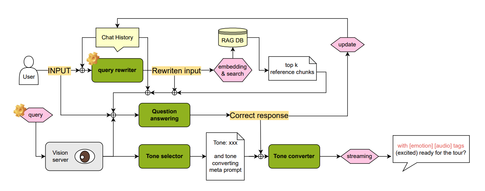

# ITRI Museum RAG + LLM System with Dynamic Tone Adaptation

A comprehensive Retrieval-Augmented Generation (RAG) system that provides intelligent, context-aware question-answering with **automatic tone adaptation** based on visual user analysis. The system combines advanced document retrieval, large language models, and vision language models to deliver personalized responses in both English and Traditional Chinese (繁體中文).

## Table of Contents

1. [What This System Does](#what-this-system-does)
2. [How The System Works](#how-the-system-works)
3. [System Architecture](#system-architecture)
4. [Step-by-Step Setup Guide](#step-by-step-setup-guide)
5. [API Reference](#api-reference)
6. [Configuration](#configuration)
7. [Troubleshooting](#troubleshooting)

---

## What This System Does

### Core Functionality

The ITRI Museum RAG + LLM System is an **intelligent question-answering service** that:

1. **Answers Questions About ITRI**: Uses a knowledge base of ITRI documents to provide accurate, factual responses about the Industrial Technology Research Institute
2. **Adapts Communication Style**: Automatically adjusts response tone based on user demographics (child-friendly, elder-friendly, professional, or casual)
3. **Maintains Conversation Context**: Remembers previous interactions within a session for follow-up questions
4. **Streams Responses in Real-Time**: Provides immediate feedback as responses are generated
5. **Supports Multiple Languages**: Handles both English and Traditional Chinese queries and responses

### Key Features

- **Hybrid RAG Search**: Combines semantic vector search (ChromaDB) with keyword search (TF-IDF) for optimal retrieval
- **Dynamic Tone Selection**: VLM-powered automatic tone adaptation (child_friendly, elder_friendly, professional_friendly, casual_friendly)
- **Parallel Processing**: Simultaneously fetches user descriptions and generates QA responses to minimize latency
- **Query Rewriting**: Intelligently rewrites user queries for better document retrieval, especially for follow-up questions
- **Session Management**: Maintains conversation history per session with graceful cleanup
- **Streaming API**: Real-time text streaming with END_FLAG termination
- **Model Warmup**: Preloads models to reduce first-request latency

### Use Cases

- **Museum Interactive Guides**: Personalized explanations about exhibits based on visitor demographics
- **Educational Platforms**: Age-appropriate content delivery for different learner groups
- **Customer Service**: Context-aware chatbots with appropriate communication styles
- **Knowledge Management**: Intelligent document retrieval and explanation systems

---

## How The System Works

### High-Level Workflow

```
                 ┌─────────────┐
                 │ User Query  │
                 └──────┬──────┘
                        │
                        ▼
┌─────────────────────────────────────────────────┐
│         Flask API Server (Port 5002)            │
│  ┌──────────────────────────────────────────┐   │
│  │  Parallel Processing (ThreadPoolExecutor)│   │
│  │  ┌──────────────┐  ┌──────────────────┐  │   │
│  │  │ Task 1:      │  │ Task 2:          │  │   │
│  │  │ Fetch User   │  │ Generate QA      │  │   │
│  │  │ Description  │  │ Response (RAG)   │  │   │
│  │  │ (Vision API) │  │                  │  │   │
│  │  └──────────────┘  └──────────────────┘  │   │
│  └──────────────────────────────────────────┘   │
│           │                    │                │
│           └──────────┬─────────┘                │
│                      ▼                          │
│  ┌──────────────────────────────────────┐       │
│  │ Determine Tone from User Description │       │
│  └──────────────────────────────────────┘       │
│                      ▼                          │
│  ┌──────────────────────────────────────┐       │
│  │  Convert Response to Selected Tone   │       │
│  └──────────────────────────────────────┘       │
└─────────────────────────────────────────────────┘
                       │
                       ▼
                ┌─────────────┐
                │   Client    │
                │ (Streaming) │
                └─────────────┘
```

### Detailed Processing Flow

#### Step 1: Query Reception & Preprocessing

When a user sends a query to `/api/rag-llm/query`:

1. **Request Parsing**: Extracts `text_user_msg`, `session_id`, `user_description`, and `convert_tone` flag
2. **Session Retrieval**: Loads conversation history for the session (if `include_history=true`)
3. **Language Detection**: Automatically detects if query contains Chinese characters

#### Step 2: Parallel Processing (Key Innovation)

The system uses **ThreadPoolExecutor** to run two tasks simultaneously:

**Task 1: Fetch User Description** (if not provided by client)
- Calls Vision Context API (`http://localhost:5004/visual-context/{session_id}`)
- Waits 2 seconds before fetching (allows VLM to process recent frames)
- Returns visual description like: "a young boy wearing glasses, and is smiling"

**Task 2: Generate QA Response**
- **Query Rewriting**: Rewrites user query using chat history context for better retrieval
  - Example: "他什麼時候上任的？" → "工研院院長張培仁博士的上任日期與就職時間"
- **RAG Retrieval**: 
  - Generates query embedding using `bge-m3:latest` model
  - Performs hybrid search in ChromaDB (dense) + TF-IDF (sparse)
  - Retrieves top 6 relevant document chunks
- **Context Processing**: Filters and ranks retrieved documents (excludes Q&A patterns)
- **LLM Generation**: 
  - Builds structured JSON prompt with `user_question`, `chat_history`, `rag_reference`, `rewritten_query`
  - Sends to Ollama LLM (`linly-llama3.1:70b-instruct-q4_0`)
  - Streams response tokens back
- **Response Collection**: Accumulates full response (max 150 chars for tone conversion)

#### Step 3: Tone Determination

After both parallel tasks complete:

1. **Visual Analysis**: If user description available, sends to tone selector agent
   - Analyzes age indicators, clothing, context
   - Returns one of: `child_friendly`, `elder_friendly`, `professional_friendly`, `casual_friendly`
2. **Default Fallback**: Uses `casual_friendly` if no description available

#### Step 4: Tone Conversion

If `convert_tone=true`:

1. **System Prompt Selection**: Retrieves specialized prompt for selected tone from `tone_system_prompts_no_tag.py`
2. **Context Integration**: 
   - Includes user appearance description
   - Includes original user message
   - Indicates if this is first message (mandatory appearance reference) or subsequent (20% probability)
3. **Streaming Conversion**: 
   - Sends to Ollama LLM with tone-specific system prompt
   - Streams converted response chunks
   - Maintains factual accuracy while adapting emotional tone

#### Step 5: Response Delivery & Session Update

1. **Streaming**: Yields tone-converted chunks (or original if no conversion)
2. **END_FLAG**: Sends `END_FLAG` when complete
3. **History Update**: Stores original (pre-tone) response in session history for future context

### Key Components Deep Dive

#### 1. RAG Pipeline (`RAG_LLM_realtime.py`)

**Document Processing**:
- Loads JSON files (raw_data, qa_pairs, structured_data, golden entries) and TXT files
- Semantic chunking (300 chars, 50 overlap) respecting sentence boundaries
- Jieba tokenization for Chinese text with domain-specific vocabulary

**Vector Store**:
- ChromaDB persistent storage with `bge-m3:latest` embeddings
- TF-IDF sparse index for keyword matching
- Hybrid search: 70% dense + 30% sparse with intelligent reranking

**Query Processing**:
- Query rewriting for better retrieval (especially follow-up questions)
- Language detection (Chinese/English)
- Context extraction and ranking

#### 2. Tone Conversion System (`tone_system_prompts_no_tag.py`)

**Four Tone Types**:

1. **child_friendly**: 
   - Role: "科學探險隊隊長" (Science Adventure Team Leader)
   - Style: Energetic, curious, uses vivid metaphors and interactive phrases
   - Example: "哇！被你發現這個超酷的秘密了！這棵大樹的頭頂上藏著六個超強的「隱形小風扇」喔！"

2. **elder_friendly**:
   - Role: "資深導覽員" (Senior Guide)
   - Style: Warm, storytelling-based, respectful with gentle expressions
   - Example: "您說的對，其實這棵大樹背後有很深的情感與科學。說起這棵樹的運作方式啊..."

3. **professional_friendly**:
   - Role: "官方專家導覽員" (Official Expert Guide)
   - Style: Professional, authoritative, uses formal vocabulary ("您" instead of "你")
   - Example: "關於生態樹的溫控機制，其核心在於透過高效能的空氣循環系統來達成。"

4. **casual_friendly**:
   - Role: "科技嚮導" (Tech Guide)
   - Style: Chill, conversational, like talking to a friend
   - Example: "其實這棵樹的設計蠻聰明的。簡單來說，它的頂端藏了六台風扇..."

**Tone Selection Logic**:
- Age 0-17: `child_friendly`
- Age 55+: `elder_friendly`
- Business/formal context: `professional_friendly`
- General adults/unclear: `casual_friendly` (default)

#### 3. API Service (`rag_llm_api.py`)

**Endpoints**:
- `/api/rag-llm/query`: Main query endpoint with optional tone conversion
- `/api/rag-llm/query-with-tone`: Query with automatic dynamic tone conversion
- `/api/rag-llm/convert-tone`: Standalone tone conversion service
- `/api/rag-llm/init`: Initialize RAG system
- `/api/rag-llm/warmup`: Preload models
- `/api/rag-llm/close`: Graceful session cleanup
- `/api/rag-llm/sessions/{id}/history`: Session history management

**Session Management**:
- In-memory storage: `chat_sessions[session_id] = [messages]`
- Stores original (pre-tone) responses for context
- Graceful cleanup on connection close

---

## System Architecture



*The diagram above illustrates the main components and data flow in the ITRI Museum RAG LLM system.*

### Component Overview

```
┌─────────────────────────────────────────────────────────────┐
│                      Client Applications                    │
│              (Web, Mobile, Desktop, CLI Tools)              │
└───────────────────────────┬─────────────────────────────────┘
                            │ HTTP/REST API
                            ▼
┌─────────────────────────────────────────────────────────────┐
│              Flask API Server (Port 5002)                   │
│  ┌──────────────────────────────────────────────────────┐   │
│  │         RAGLLMAPIService Class                       │   │
│  │      • Session Management                            │   │
│  │      • Parallel Processing Orchestration             │   │
│  │      • Tone Conversion Coordination                  │   │
│  │      • Streaming Response Handling                   │   │
│  └──────────────────────────────────────────────────────┘   │
└───────┬───────────────────┬───────────────────┬─────────────┘
        │                   │                   │
        ▼                   ▼                   ▼
┌──────────────┐   ┌────────────────┐   ┌──────────────┐
│  RAG Pipeline│   │ Vision Context │   │  Ollama LLM  │
│  (ChromaDB)  │   │  API (VLM)     │   │ (Port 11435) │
│              │   │  (Port 5004)   │   │              │
│  • Document  │   │                │   │  • QA Agent  │
│    Loading   │   │  • Visual      │   │  • Tone      │
│  • Chunking  │   │    Analysis    │   │    Converter │
│  • Embedding │   │  • User Desc   │   │  • Query     │
│  • Hybrid    │   │    Generation  │   │    Rewriter  │
│    Search    │   │                │   │              │
└──────────────┘   └────────────────┘   └──────────────┘
```

### External Dependencies

1. **Ollama LLM Service** (localhost:11435)
   - Model: `linly-llama3.1:70b-instruct-q4_0` (QA generation)
   - Embedding Model: `bge-m3:latest` (vector embeddings)
   - APIs: `/api/chat`, `/api/embeddings`

2. **ChromaDB** (Persistent Vector Database)
   - Path: Configurable via `CHROMA_DB_PATH` in `config.py`
   - Collection: `{museum_name}_collection` (e.g., `itri_museum_collection`)
   - Embedding Function: Uses Ollama embedding API

3. **Vision Context API** (localhost:5004, optional)
   - Endpoint: `/visual-context/{session_id}`
   - Returns: `{"available": bool, "visual_context": str}`
   - Purpose: Real-time VLM-based user appearance analysis

---

## Step-by-Step Setup Guide

### Quick Start Summary

For experienced users, here's the complete setup sequence:

```bash
# 1. Clone repository
git clone git@github.com:HelloHe110/Demo_llm_agent.git
cd Demo_llm_agent

# 2. Create and activate virtual environment
python3 -m venv venv
source venv/bin/activate
pip install --upgrade pip
pip install flask flask-cors requests chromadb numpy scikit-learn jieba gradio

# 3. Configure config.py
# Edit config.py: Set LLM_MODEL_NAME and CHROMA_DB_PATH

# 4. Start Ollama server (Terminal 1)
CUDA_VISIBLE_DEVICES=0,1,2,3 OLLAMA_HOST=127.0.0.1:11435 ollama serve

# 5. Download models (Terminal 2)
ollama pull linly-llama3.1:70b-instruct-q4_0
ollama pull bge-m3:latest

# 6. Build ChromaDB (Terminal 2)
cd LLM_Chat
python create_showroom_db.py --golden --reload --embedding-model bge-m3:latest

# 7. Start API server (Terminal 3)
cd ../API
python rag_llm_api.py --auto-init

# 8. Start warmup server (Terminal 4, optional)
cd API
python model_warmup_server.py --api-url http://localhost:5002 --interval 60

# 9. Test client (Terminal 5)
cd API
python test_rag_llm_api.py --usr_msg "工研院是什麼？" --session_id "test"
```

### Prerequisites

- **Operating System**: Linux (Ubuntu/Debian recommended)
- **Python**: 3.8 or higher
- **CUDA**: Compatible GPU with CUDA support (optional but recommended for LLM)
- **Memory**: Minimum 16GB RAM (32GB+ recommended for 70B model)
- **Storage**: At least 50GB free space for models and data

### Step 1: Clone the Repository

```bash
git clone git@github.com:HelloHe110/Demo_llm_agent.git
cd Demo_llm_agent
```

Or using HTTPS:
```bash
git clone https://github.com/HelloHe110/Demo_llm_agent.git
cd Demo_llm_agent
```

### Step 2: Set Up Python Environment

#### Option A: Using Virtual Environment (venv) - Recommended

```bash
# Create virtual environment
python3 -m venv venv

# Activate virtual environment
# On Linux/macOS:
source venv/bin/activate
# On Windows:
# venv\Scripts\activate

# Upgrade pip
pip install --upgrade pip

# Install required packages
pip install flask flask-cors requests chromadb numpy scikit-learn jieba gradio
```

#### Option B: Using Conda

```bash
# Create conda environment
conda create -n rag_llm python=3.8 -y

# Activate conda environment
conda activate rag_llm

# Install required packages
pip install flask flask-cors requests chromadb numpy scikit-learn jieba gradio
```

**Required Python Packages**:
- `flask`: Web framework for API server
- `flask-cors`: Cross-origin resource sharing support
- `requests`: HTTP library for API calls
- `chromadb`: Vector database for document storage
- `numpy`: Numerical computing
- `scikit-learn`: Machine learning utilities (TF-IDF)
- `jieba`: Chinese text segmentation
- `gradio`: Optional web UI for RAG pipeline

### Step 3: Set Up Ollama Server

#### 3.1 Install Ollama

```bash
curl -fsSL https://ollama.ai/install.sh | sh
```

#### 3.2 Start Ollama Server

```bash
# With GPU support (recommended)
CUDA_VISIBLE_DEVICES=0,1,2,3 \
OLLAMA_HOST=127.0.0.1:11435 \
OLLAMA_MODELS=/usr/share/ollama/.ollama/models \
OLLAMA_SCHED_SPREAD=1 \
OLLAMA_FLASH_ATTENTION=1 \
OLLAMA_KEEP_ALIVE=60m \
ollama serve
```

#### 3.3 Download Required Models

Open a new terminal (keep Ollama running):

```bash
# Main language model for QA generation
ollama pull linly-llama3.1:70b-instruct-q4_0

# Embedding model for vector search
ollama pull bge-m3:latest
```

**Note**: The 70B model requires significant GPU memory. If you have limited resources, you can use a smaller model by updating `config.py`:
```python
LLM_MODEL_NAME = "linly-llama3.1:8b-instruct-q4_0"  # Smaller alternative
```

### Step 4: Prepare Document Data

#### 4.1 Organize Your Documents

The system uses **two different approaches** for document processing:

**Approach 1: Structured Data (Recommended for QA/Glossary/News)**

Place your structured JSON files in:
```
LLM_Chat/
└── database_wiki_gemini整理_一定對的.../
    ├── qa_pairs.json
    ├── glossary.json
    ├── news.json
    └── ...
```

**Approach 2: General Documents**

Place your general documents in:
```
Demo_GitSpace/
├── LLM_Chat/
│   └── itri_museum_docs/          # General document directory
│       ├── raw_data.json
│       ├── qa_pairs.json
│       ├── structured_data.json
│       └── text_files/
│           └── *.txt
```

#### 4.2 Document Format for `create_showroom_db.py`

The `create_showroom_db.py` script supports multiple structured formats:

<details>
<summary><strong>QA Pairs Format</strong></summary>

```json
[
  {
    "question": "工研院是什麼？",
    "answer": "工研院是台灣最大的產業技術研發機構..."
  },
  {
    "question": "工研院成立於何時？",
    "answer": "工研院成立於1973年..."
  }
]
```

</details>

<details>
<summary><strong>Glossary Format</strong></summary>

```json
[
  {
    "term": "ITRI",
    "full_name": "Industrial Technology Research Institute",
    "content": "工研院成立於1973年，是台灣最大的產業技術研發機構..."
  }
]
```

</details>

<details>
<summary><strong>News Format</strong></summary>

```json
[
  {
    "date": "2025-01-01",
    "title": "工研院新技術突破",
    "content": "工研院今日宣布..."
  }
]
```

</details>

<details>
<summary><strong>General Format</strong></summary>

```json
[
  {
    "title": "工研院簡介",
    "content": "工研院成立於1973年，是台灣最大的產業技術研發機構..."
  }
]
```

</details>

**Important**: Each JSON file should contain a **list of objects**. The script processes each item as a single chunk (One Item = One Chunk strategy).

### Step 5: Build the Vector Database

#### 5.1 Prepare Your Data

Organize your ITRI documents in JSON format. The script supports multiple data formats:

<details>
<summary><strong>QA Pairs Format</strong></summary>

```json
[
  {
    "question": "工研院是什麼？",
    "answer": "工研院是台灣最大的產業技術研發機構..."
  }
]
```

</details>

<details>
<summary><strong>Glossary Format</strong></summary>

```json
[
  {
    "term": "ITRI",
    "full_name": "Industrial Technology Research Institute",
    "content": "工研院成立於1973年..."
  }
]
```

</details>

<details>
<summary><strong>News Format</strong></summary>

```json
[
  {
    "date": "2025-01-01",
    "title": "工研院新技術突破",
    "content": "工研院今日宣布..."
  }
]
```

</details>

<details>
<summary><strong>General Format</strong></summary>

```json
[
  {
    "title": "工研院簡介",
    "content": "工研院成立於1973年..."
  }
]
```

</details>

Place your JSON files in:
```
LLM_Chat/
└── database_wiki_gemini整理_一定對的.../
    ├── qa_pairs.json
    ├── glossary.json
    ├── news.json
    └── ...
```

#### 5.2 Create ChromaDB Database

Use the dedicated script to build the vector database:

```bash
cd LLM_Chat
python create_showroom_db.py --golden --reload --embedding-model bge-m3:latest
```

**With Custom Options**:
```bash
python create_showroom_db.py \
  --data-folder "database_wiki_gemini整理_一定對的..." \
  --collection-name "chroma_db_golden" \
  --embedding-model "bge-m3:latest" \
  --golden \
  --reload
```

**What This Script Does**:
- Loads JSON files from `database_wiki_gemini整理_一定對的.../` folder
- Processes each JSON item as a single chunk (One Item = One Chunk strategy)
- Generates embeddings using `bge-m3:latest` via Ollama API
- Stores in ChromaDB collection named `chroma_db_golden`
- Creates ChromaDB at path: `{CHROMA_DB_PATH}/chroma_db_golden`

**Expected Output**:
```
================================================================================
Creating ChromaDB database: chroma_db_golden
================================================================================
ChromaDB path: /path/to/chroma_db_golden
Data folder: database_wiki_gemini整理_一定對的...
Found 5 JSON files in database_wiki_gemini整理_一定對的...
   - Processing qa_pairs.json (100 items)...
   - Processing glossary.json (50 items)...
Reloading vector store...
   - Deleted existing collection.
   - Created new collection.
Generating embeddings using [bge-m3:latest]...
   Processing batch 1/15 (10 items)
   Processing batch 2/15 (10 items)
   ...
Database creation completed! Stored 150 items.
```

#### 5.3 Verify Database

Check that ChromaDB was created:
```bash
# Check ChromaDB directory
ls -la chroma_db_golden/

# Or verify collection exists (using Python)
python -c "import chromadb; client = chromadb.PersistentClient(path='chroma_db_golden'); print(client.list_collections())"
```

**Note**: The `create_showroom_db.py` script uses a **different chunking strategy** than `RAG_LLM_realtime.py`:
- `create_showroom_db.py`: One JSON item = One chunk (preserves document structure)
- `RAG_LLM_realtime.py`: Semantic chunking with 300 chars, 50 overlap (for general documents)

**Important**: After building the database, verify that the path in `config.py` (`CHROMA_DB_PATH`) matches the location where the database was created. The database will be at `{CHROMA_DB_PATH}/chroma_db_golden`.

### Step 6: Configure the System

#### 6.1 Update `config.py`

The `config.py` file is located in the root directory and contains essential system configuration. Update it according to your setup:

```python
# LLM Model Configuration
# This model is used for QA generation, tone conversion, and query rewriting
LLM_MODEL_NAME = "linly-llama3.1:70b-instruct-q4_0"

# ChromaDB Path Configuration
# This path should point to the directory containing your ChromaDB database
# The actual collection will be created at: {CHROMA_DB_PATH}/chroma_db_golden
CHROMA_DB_PATH = "/mnt/HDD4/thanglq/he110/Demo_GitSpace/chroma_db_golden"

# Or use relative path (relative to project root):
# CHROMA_DB_PATH = "./chroma_db_golden"
```

**Configuration Details**:

- **`LLM_MODEL_NAME`**: Specifies the Ollama model to use for text generation. The default `linly-llama3.1:70b-instruct-q4_0` is a 70B parameter model. For systems with limited GPU memory, you can use a smaller model:
  ```python
  LLM_MODEL_NAME = "linly-llama3.1:8b-instruct-q4_0"  # Smaller alternative
  ```

- **`CHROMA_DB_PATH`**: The base directory path where ChromaDB stores its data. The `create_showroom_db.py` script creates the database at `{CHROMA_DB_PATH}/chroma_db_golden`. Make sure:
  1. This path matches where you ran `create_showroom_db.py`
  2. The directory exists and is writable
  3. You use absolute paths for production deployments

**Important**: 
- Ensure `CHROMA_DB_PATH` matches the location where `create_showroom_db.py` created the database
- The path can be absolute (recommended) or relative to the project root
- Both `API/rag_llm_api.py` and `LLM_Chat/RAG_LLM_realtime.py` import from this config file

#### 6.2 (Optional) Set Up Vision Context API

If you want to use real VLM-based user analysis:

```bash
# Install vision API dependencies
pip install fastapi uvicorn

# Start Vision Context API (in separate terminal)
python vision_api_multi_session.py
# Server starts on port 5004
```

For development/testing, you can use the random description server instead:
```bash
cd API
python random_user_description_server.py
# Server starts on port 5003
```

### Step 7: Start the RAG LLM API Server

**Important**: Make sure Ollama server is running (from Step 3) before starting the API server.

#### 7.1 Basic Startup

```bash
cd API
python3 rag_llm_api.py --auto-init
```

This will:
- Auto-initialize the RAG system (load ChromaDB)
- Start the Flask server on `http://0.0.0.0:5002`
- Enable CORS for cross-origin requests

#### 7.2 With Vision Integration

**Development (Random Descriptions)**:
```bash
# First, start the random description server (in a separate terminal)
python3 random_user_description_server.py --port 5003

# Then start the API server with vision integration
python3 rag_llm_api.py --auto-init --user-description-server http://localhost:5003
```

**Production (Real VLM)**:
```bash
# Start Vision Context API first (in a separate terminal)
# python vision_api_multi_session.py  # Port 5004

# Then start the API server
python3 rag_llm_api.py --auto-init --user-description-server http://localhost:5004
```

#### 7.3 Custom Host/Port

```bash
python3 rag_llm_api.py --host 0.0.0.0 --port 5002 --auto-init --debug
```

**Command Line Options**:
- `--host`: Host to bind to (default: `0.0.0.0`)
- `--port`: Port to bind to (default: `5002`)
- `--auto-init`: Automatically initialize RAG system on startup
- `--debug`: Enable Flask debug mode
- `--user-description-server`: URL of Vision Context API (optional)

**Expected Output**:
```
RAG + LLM API Service Starting
======================================================================
Service URL: http://0.0.0.0:5002
Health Check: GET http://0.0.0.0:5002/health
Query Endpoint: POST http://0.0.0.0:5002/api/rag-llm/query
Tone Convert: POST http://0.0.0.0:5002/api/rag-llm/convert-tone
Query + Dynamic Tone: POST http://0.0.0.0:5002/api/rag-llm/query-with-tone
Init Endpoint: POST http://0.0.0.0:5002/api/rag-llm/init
Warmup Endpoint: POST http://0.0.0.0:5002/api/rag-llm/warmup
Close Endpoint: POST http://0.0.0.0:5002/api/rag-llm/close
======================================================================
Auto-initializing RAG system...
RAG system initialized
 * Running on http://0.0.0.0:5002
```

### Step 8: Start Model Warmup Server (Optional but Recommended)

The model warmup server keeps models preloaded to reduce latency. Start it in a separate terminal:

```bash
cd API
python3 model_warmup_server.py --api-url http://localhost:5002 --interval 60
```

**What This Does**:
- Periodically warms up both embedding model and LLM every 60 minutes (configurable)
- Monitors API service health
- Tracks warmup statistics
- Reduces first-request latency significantly

**Options**:
- `--api-url`: URL of the RAG LLM API service (default: `http://localhost:5002`)
- `--interval`: Warmup interval in minutes (default: `60`)
- `--test`: Run a single warmup test and exit

**Note**: You can also manually warmup models once using:
```bash
curl -X POST http://localhost:5002/api/rag-llm/warmup
```

### Step 9: Verify Installation

#### 9.1 Health Check

```bash
curl http://localhost:5002/health
```

Expected response:
```json
{
  "status": "healthy",
  "rag_initialized": true,
  "timestamp": 1234567890.123
}
```

#### 9.2 Warm Up Models (If Not Using Warmup Server)

```bash
curl -X POST http://localhost:5002/api/rag-llm/warmup
```

This preloads models to reduce first-request latency.

#### 9.3 Test Query

**English Query**:
```bash
curl -X POST http://localhost:5002/api/rag-llm/query \
  -H "Content-Type: application/json" \
  -d '{
    "text_user_msg": "What is ITRI?",
    "session_id": "test_session",
    "convert_tone": false
  }' \
  --no-buffer
```

**Traditional Chinese Query**:
```bash
curl -X POST http://localhost:5002/api/rag-llm/query \
  -H "Content-Type: application/json" \
  -d '{
    "text_user_msg": "工研院是什麼？",
    "session_id": "test_session",
    "convert_tone": false
  }' \
  --no-buffer
```

**With Tone Conversion**:
```bash
curl -X POST http://localhost:5002/api/rag-llm/query-with-tone \
  -H "Content-Type: application/json" \
  -d '{
    "text_user_msg": "工研院是什麼？",
    "session_id": "test_session",
    "user_description": "a young boy wearing glasses",
    "convert_tone": true
  }' \
  --no-buffer
```

### Step 10: Test with Client Script

The project includes a comprehensive test client script. Run it to verify the complete system:

```bash
cd API
python3 test_rag_llm_api.py --usr_msg "工研院是什麼？" --session_id "test_session"
```

**Test Client Options**:
```bash
python3 test_rag_llm_api.py \
  --usr_msg "Your question here" \
  --session_id "your_session_id" \
  --user_description "a young boy wearing glasses" \
  --convert_tone \
  --base_url http://localhost:5002
```

**What the Test Client Does**:
- Checks service health
- Initializes RAG system if needed
- Sends query with streaming response
- Displays response in real-time
- Shows session history
- Demonstrates proper session cleanup

**Other Example Clients**:

Basic API client example:
```bash
python3 api_client_example.py
```

Tone conversion example:
```bash
python3 api_client_tone_example.py
```

---

## API Reference

### Core Endpoints

#### `POST /api/rag-llm/query`

Main query endpoint with optional tone conversion.

**Request Body**:
```json
{
  "text_user_msg": "Your question here",
  "session_id": "optional_session_id",
  "include_history": true,
  "user_description": "visual description (optional)",
  "convert_tone": false
}
```

**Response**: Streaming text chunks followed by `END_FLAG`

**Example**:
```bash
curl -X POST http://localhost:5002/api/rag-llm/query \
  -H "Content-Type: application/json" \
  -d '{"text_user_msg": "What is ITRI?", "session_id": "demo"}' \
  --no-buffer
```

#### `POST /api/rag-llm/query-with-tone`

Query with automatic dynamic tone conversion.

**Request Body**:
```json
{
  "text_user_msg": "Your question",
  "session_id": "session_id",
  "user_description": "a young boy wearing glasses",
  "convert_tone": true
}
```

**Response**: Streaming tone-adapted response with `END_FLAG`

#### `POST /api/rag-llm/convert-tone`

Standalone tone conversion service.

**Request Body**:
```json
{
  "text": "Text to convert",
  "tone": "child_friendly",
  "stream": true,
  "user_description": "visual description",
  "user_msg": "original user message"
}
```

#### `POST /api/rag-llm/init`

Initialize the RAG system (loads ChromaDB, builds indices).

**Response**:
```json
{
  "success": true,
  "rag_initialized": true,
  "message": "RAG system initialized successfully"
}
```

#### `POST /api/rag-llm/warmup`

Preload embedding model and LLM to reduce latency.

**Response**:
```json
{
  "embedding_model": {
    "status": "success",
    "time_ms": 123.45
  },
  "llm_model": {
    "status": "success",
    "time_ms": 567.89
  },
  "overall_success": true
}
```

#### `POST /api/rag-llm/close`

Gracefully close session and clean up history.

**Request Body**:
```json
{
  "session_id": "session_to_close"
}
```

#### `GET /api/rag-llm/sessions/{session_id}/history`

Get conversation history for a session.

#### `DELETE /api/rag-llm/sessions/{session_id}/history`

Clear conversation history for a session.

---

## Configuration

### Environment Variables

```bash
# GPU Configuration
export CUDA_VISIBLE_DEVICES=0,1,2,3

# Ollama Configuration
export OLLAMA_HOST=127.0.0.1:11435
export OLLAMA_MODELS=/usr/share/ollama/.ollama/models
export OLLAMA_SCHED_SPREAD=1
export OLLAMA_FLASH_ATTENTION=1
export OLLAMA_KEEP_ALIVE=60m
```

### Configuration File (`config.py`)

The `config.py` file in the project root is the central configuration file used by both the API server and RAG pipeline.

**Location**: `./config.py` (root directory)

**Configuration Variables**:

```python
# LLM Model Configuration
# Used for QA generation, tone conversion, query rewriting, and tone selection
LLM_MODEL_NAME = "linly-llama3.1:70b-instruct-q4_0"

# ChromaDB Path Configuration
# Base directory where ChromaDB stores its data
# The actual collection is created at: {CHROMA_DB_PATH}/chroma_db_golden
CHROMA_DB_PATH = "/path/to/chroma_db_golden"
```

**Usage**:
- Both `API/rag_llm_api.py` and `LLM_Chat/RAG_LLM_realtime.py` import from `config.py`
- Changes to `config.py` require restarting the API server
- Use absolute paths for production deployments
- Ensure `CHROMA_DB_PATH` matches where `create_showroom_db.py` created the database

**Model Options**:
- Default: `linly-llama3.1:70b-instruct-q4_0` (70B parameters, requires significant GPU memory)
- Alternative: `linly-llama3.1:8b-instruct-q4_0` (8B parameters, suitable for limited resources)

### API Server Options

```bash
python3 rag_llm_api.py \
  --host 0.0.0.0 \              # Host to bind to
  --port 5002 \                 # Port to bind to
  --debug \                     # Enable debug mode
  --auto-init \                 # Auto-initialize RAG on startup
  --user-description-server http://localhost:5004  # Vision API URL
```

---

## Troubleshooting

### Issue: Ollama Server Not Responding

**Symptoms**: Connection errors when calling LLM API

**Solutions**:
```bash
# Check if Ollama is running
curl http://localhost:11435/api/tags

# Restart Ollama
pkill ollama
ollama serve

# Verify models are downloaded
ollama list
```

### Issue: ChromaDB Not Found

**Symptoms**: "No ChromaDB found" or collection errors

**Solutions**:
```bash
# Check ChromaDB path in config.py
cat config.py | grep CHROMA_DB_PATH

# Verify directory exists
ls -la $(python -c "from config import CHROMA_DB_PATH; print(CHROMA_DB_PATH)")

# Rebuild database using create_showroom_db.py
cd LLM_Chat
python create_showroom_db.py --reload

# Verify collection exists
python -c "import chromadb; client = chromadb.PersistentClient(path='chroma_db_golden'); print([c.name for c in client.list_collections()])"
```

### Issue: Embedding Dimension Mismatch

**Symptoms**: "expecting embedding with dimension X" errors

**Solutions**:
- Rebuild ChromaDB with current embedding model
- Ensure using same embedding model (`bge-m3:latest`) for both building and querying

### Issue: Chinese Text Processing Errors

**Symptoms**: Jieba tokenization failures

**Solutions**:
```bash
# Reinstall Jieba
pip uninstall jieba
pip install jieba

# Clear cache
rm -rf ~/.jieba_cache/
```

### Issue: Vision API Connection Failed

**Symptoms**: "Could not connect to Vision Context API"

**Solutions**:
- Check if Vision API server is running: `curl http://localhost:5004/sessions`
- Use random description server for testing: `--user-description-server http://localhost:5003`
- System will fallback to `casual_friendly` tone if Vision API unavailable

### Issue: Slow First Request

**Solutions**:
```bash
# Warm up models before first real request
curl -X POST http://localhost:5002/api/rag-llm/warmup
```

### Issue: Port Already in Use

**Solutions**:
```bash
# Find process using port
lsof -i :5002

# Kill process or use different port
python3 rag_llm_api.py --port 5003
```

---

## Additional Resources

- [RAG Pipeline Documentation](LLM_Chat/README.md)
- [LLM Server Methodology](RAG_LLM_Server_Methodology.md)
- [API Documentation](API/README.md)

---

## Contributing

Contributions are welcome! Please:
1. Fork the repository
2. Create a feature branch
3. Make your changes with proper documentation
4. Test thoroughly
5. Submit a pull request

---

## License

This project is developed for educational and research purposes at the Industrial Technology Research Institute (ITRI).

---

